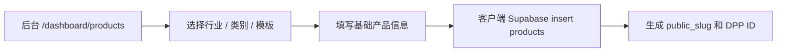
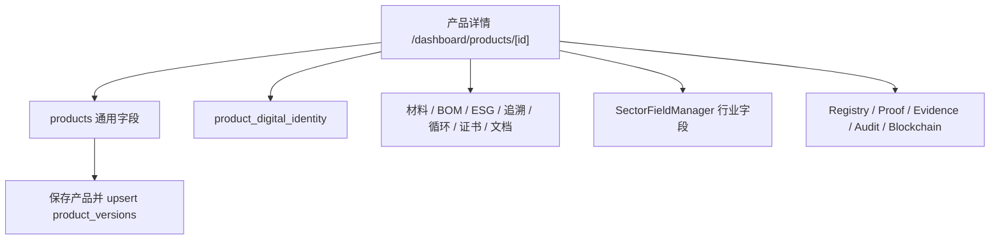
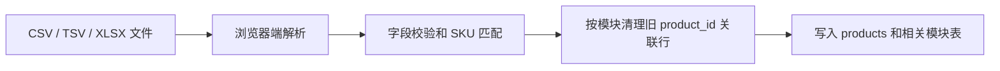
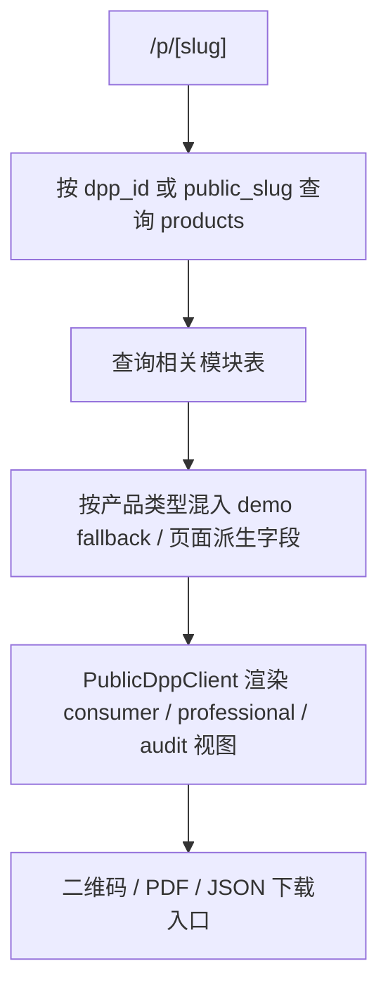

# Greanlean 当前系统盘点

版本：Phase 1 / current-system-audit  
分支：`feature/battery-dpp`  
盘点日期：2026-07-22  
范围：只读取当前项目并形成现状审计，不修改业务代码、数据库结构或生产环境。

## 1. 结论摘要

Greanlean 当前是一个基于 Next.js 14 App Router 和 Supabase 的 DPP 演示与后台管理平台。系统已经具备官网、登录、产品中心、产品详情录入、批量导入、公开 DPP 页面、二维码、GS1 Digital Link 跳转、PDF/JSON 导出、证据 Hash、版本记录、Registry 提交记录和区块链锚定记录等基础模块。

当前架构已经有“通用产品表 + 关联模块表 + 行业字段模板表”的雏形，但仍存在几个关键问题：

- 前端、后端和数据治理边界不够清晰，大量 Supabase 写操作直接在客户端组件中执行。
- 电池 DPP 目前主要通过通用模块和 `product_sector_field_values` 承载，缺少明确的电池型号、批次、单体电池和动态运行数据分层。
- 化学合规、产品性能等模块仍有页面硬编码和文件生成兜底，尚未完全数据库化。
- Registry、区块链和审计日志表已存在，但还没有真正的 EU DPP Registry API 适配层和不可篡改链路闭环。
- 测试体系缺失，只有 `next build` 可作为基本构建验证。

第一阶段建议先保持现有功能稳定，不立即重构大组件；第二阶段再以目标架构和数据库设计为准，逐步迁移到“通用 DPP 核心 + 电池行业扩展 + 运行动态数据 + Registry 适配”的结构。

## 2. 技术栈

| 项目 | 当前状态 |
|---|---|
| 前端框架 | Next.js `14.2.15`，React `18.3.1`，App Router |
| 后端框架 | Next.js Route Handlers，位于 `app/api/*/route.ts` 和 `app/01/[gtin]/[[...segments]]/route.ts` |
| 样式 | Tailwind CSS `3.4.13`，全局样式在 `app/globals.css` |
| 数据库客户端 | `@supabase/supabase-js` `2.45.4` |
| 数据库 | Supabase Postgres |
| 二维码 | `qrcode` 包，在 `/api/qr` 生成 PNG |
| 国际化 | 自建 `LanguageProvider` + URL `?lang=zh/en`；项目也安装了 `next-intl`，但当前主要未使用 |
| 类型系统 | TypeScript |
| 测试框架 | 未发现 Jest、Vitest、Playwright 等测试配置 |
| 部署 | README 指向 GitHub `main` 推送后由 Vercel 部署 |

`package.json` 当前脚本：

```json
{
  "dev": "next dev",
  "build": "next build",
  "start": "next start"
}
```

## 3. 当前目录树

```text
.
.env.example
README.md
README_OPTIMIZED.md
app
app/01/[gtin]/[[...segments]]/route.ts
app/api/chemical-document/route.ts
app/api/declaration/route.ts
app/api/dpp-export/route.ts
app/api/qr/route.ts
app/dashboard
app/dashboard/certificates/page.tsx
app/dashboard/esg/page.tsx
app/dashboard/import/page.tsx
app/dashboard/layout.tsx
app/dashboard/leads/page.tsx
app/dashboard/materials/page.tsx
app/dashboard/page.tsx
app/dashboard/products/[id]/page.tsx
app/dashboard/products/page.tsx
app/dashboard/suppliers/page.tsx
app/globals.css
app/layout.tsx
app/login/page.tsx
app/p/[slug]/page.tsx
app/page.tsx
components
components/BrandLogo.tsx
components/DashboardShell.tsx
components/DemoDataSyncButton.tsx
components/DppImportManager.tsx
components/LanguageProvider.tsx
components/LanguageSwitcher.tsx
components/LeadForm.tsx
components/LeadManager.tsx
components/ProductEditor.tsx
components/ProductManager.tsx
components/ProductRelatedManager.tsx
components/PublicDppClient.tsx
components/PublicDppPreviewLoader.tsx
components/PublicHeader.tsx
components/SectorFieldManager.tsx
components/SimpleInsertManager.tsx
components/SupplierProductManager.tsx
docs
docs/greanlean-dpp-standard-data-model.md
docs/greanlean-product-planning-manual.md
docs/schemas
lib
lib/dppCompliance.ts
lib/dppSectorProfiles.ts
lib/i18n.ts
lib/slugify.ts
lib/supabase.ts
locales
public/images
supabase
supabase/schema.sql
supabase/product_category_profiles.sql
supabase/product_lifecycle_versioning.sql
supabase/optimization_patch.sql
supabase/upsert_demo_products.sql
supabase/upsert_office_chair_demo.sql
supabase/upsert_wpc_flooring_from_excel.sql
supabase/update_lmt_ebike_battery_image.sql
tailwind.config.ts
tsconfig.json
```

说明：目录中存在 `.env.local`、`.DS_Store`、`tsconfig.tsbuildinfo` 等本地文件；`.env.local` 不应提交，`.DS_Store` 与 `tsconfig.tsbuildinfo` 建议确认是否已在 `.gitignore` 覆盖。

## 4. 当前页面与功能清单

### 4.1 公开端

| 路由 | 功能 |
|---|---|
| `/` | 官网首页、产品护照示例入口、线索表单 |
| `/p/[slug]` | 公开 DPP 页面，支持 DPP ID 或 public slug |
| `/01/[gtin]/[[...segments]]` | GS1 Digital Link 解析并重定向到公开 DPP |
| `/api/qr` | 根据 URL 生成二维码 PNG |
| `/api/dpp-export` | 导出 DPP JSON 或 PDF |
| `/api/declaration` | 生成演示版声明 PDF |
| `/api/chemical-document` | 生成演示版化学文件 PDF |

公开 DPP 页面支持：

- `?lang=zh` / `?lang=en`
- `?view=consumer` / `?view=professional` / `?view=audit`
- `?preview=1` 用于预览草稿或非公开状态产品

### 4.2 后台端

| 路由 | 功能 |
|---|---|
| `/login` | Supabase email/password 登录 |
| `/dashboard` | DPP 工作流首页 |
| `/dashboard/products` | 产品中心，创建 DPP 草稿，选择行业/品类/模板 |
| `/dashboard/products/[id]` | 产品详情，编辑通用字段、模块数据、行业字段、版本、Registry、证据、审计和区块链记录 |
| `/dashboard/import` | CSV/TSV/XLSX 批量导入 |
| `/dashboard/suppliers` | 供应商库和产品关联 |
| `/dashboard/leads` | 官网线索管理 |
| `/dashboard/materials` | 材料快录 |
| `/dashboard/esg` | ESG 快录 |
| `/dashboard/certificates` | 证书快录 |

## 5. 当前数据存储方式

系统使用 Supabase Postgres。所有核心数据表和 RLS 策略主要在 `supabase/schema.sql` 中定义，另外存在多个增量 SQL 和 demo upsert SQL。

### 5.1 当前主表

| 表 | 用途 |
|---|---|
| `leads` | 官网客户线索 |
| `products` | 产品通用核心数据、DPP ID、公开 slug、分类和发布状态 |
| `dpp_category_profiles` | DPP 行业/品类/子类模板定义 |
| `dpp_field_templates` | 行业模板字段定义 |
| `dpp_validation_rules` | 行业模板验证规则，当前主要是结构预留 |
| `product_sector_field_values` | 产品级行业专属字段值 |
| `product_versions` | 版本历史、快照和 SHA-256 Hash |
| `product_suppliers` | 供应商库 |
| `supplier_products` | 供应商与产品关联 |
| `product_materials` | 材料组成与来源 |
| `product_bom` | 组件、包装、辅料 |
| `product_esg_metrics` | 碳、水、能源、废弃物、再生成分等 ESG 指标 |
| `product_certificates` | 证书和检测报告 |
| `product_traceability` | 生产、运输和供应链追溯事件 |
| `product_circularity` | 可维修、可回收、回收计划、生命周期结束信息 |
| `product_consumer_transparency` | 消费者透明化文案 |
| `product_digital_identity` | GTIN、批次、序列号、GS1 Digital Link、QR/NFC/RFID |
| `product_documents` | 文件记录 |
| `product_data_governance` | 数据来源、负责人、审计状态、质量评分 |
| `dpp_registry_submissions` | EU DPP Registry 提交记录预留 |
| `dpp_registration_proofs` | 注册证明预留 |
| `dpp_evidence_links` | 字段与证据的关联 |
| `dpp_audit_logs` | 审计日志 |
| `dpp_blockchain_anchors` | 区块链锚定记录 |

### 5.2 当前数据字段清单

以下为 `supabase/schema.sql` 中现有字段摘要：

| 表 | 字段摘要 |
|---|---|
| `products` | `id`, `name`, `sku`, `brand`, `category`, `subcategory`, `sector_code`, `category_code`, `subcategory_code`, `dpp_profile_key`, `description`, `status`, `current_version`, `granularity_level`, `commodity_code`, `unique_product_identifier`, `eu_registration_status`, `dpp_id`, `public_slug`, `main_image`, `name_zh`, `description_zh`, `season`, `care_instructions`, `repair_instructions`, `end_of_life_instructions`, timestamps |
| `product_sector_field_values` | `product_id`, `profile_key`, `module_key`, `field_key`, labels, `field_value`, `field_value_json`, `unit`, `evidence_status`, `source_type`, `visibility_level` |
| `product_digital_identity` | `product_uuid`, `gtin`, `style_id`, `batch_id`, `serial_id`, `digital_link_url`, `data_carrier_type`, `data_carrier_url`, `qr_code_id`, `nfc_id`, `rfid_epc` |
| `product_materials` | material name/type, percentage, recycled content, origin, chemical info, recyclability, certification, supplier |
| `product_bom` | component name/type, quantity, unit, position |
| `product_esg_metrics` | carbon footprint, water, energy, waste, recycled content, chemical management, LCA URL, methodology, verifier |
| `product_certificates` | certificate name/type/number, issuer, issue/expiry dates, URL, verification status, evidence hash, visibility |
| `product_traceability` | event type/name/date, country/city/facility, supplier name, transport method, verification status, notes |
| `product_circularity` | repairability/recyclability score, take-back program, resale/remanufacturing flags, disassembly/recycling/EOL info |
| `product_documents` | document name/type, file URL, file size, language, uploaded by, version, evidence hash, visibility |
| `product_versions` | version, lifecycle status, change type/summary, changed by, snapshot, data hash |
| `dpp_registry_submissions` | status, environment, EU registration identifier, commodity code, submitted version/hash, semantic model version, payload, response, timestamps, rejected reason |
| `dpp_blockchain_anchors` | version, anchored hash, chain/network/contract/tx/block, status, explorer URL |

完整字段以 `supabase/schema.sql` 为准。

## 6. 当前行业模板与分类

代码层 `lib/dppSectorProfiles.ts` 内置以下模板：

| Profile key | 行业 | 当前定位 |
|---|---|---|
| `battery.ev.unit.v1` | 电池 | EV 电池单元 |
| `battery.lmt.unit.v1` | 电池 | LMT 轻型交通工具电池单元 |
| `battery.industrial.without_bms.v1` | 电池 | 无 BMS 工业电池 |
| `battery.industrial.other_above_2kwh.v1` | 电池 | 其他 2kWh 以上工业电池 |
| `battery.industrial.stationary_above_2kwh.v1` | 电池 | 固定式 2kWh 以上工业电池 |
| `textile.apparel.garment.v1` | 纺织 | 服装 |
| `textile.fabric.woven.v1` | 纺织 | 梭织面料 |
| `furniture.office.chair.v1` | 家具 | 办公椅 |
| `construction.material.wpc_decking.v1` | 建材 | 木塑地板 |
| `consumer_electronics.audio_device.v1` | 消费电子 | 音频设备 |

注意：模板字段在 `lib/dppSectorProfiles.ts`、`components/SectorFieldManager.tsx`、`supabase/product_category_profiles.sql`、`supabase/schema.sql` 中存在多处定义或 fallback，后续需要收敛为单一数据字典来源。

## 7. 当前数据流说明

### 7.1 创建产品



当前创建逻辑在 `components/ProductManager.tsx`。DPP ID 使用随机字符串生成，尚未与 Registry 或 GS1 主数据注册闭环。

### 7.2 产品详情录入



当前大多数模块通过通用组件 `ProductRelatedManager` 对 Supabase 表直接增删改查。版本保存会生成 SHA-256 Hash，但快照主要包含 `products` 行，不包含所有关联模块的完整状态。

### 7.3 批量导入



当前导入逻辑在 `components/DppImportManager.tsx`。支持下载 CSV 和 XLSX 模板；上传解析在浏览器端完成。模块包括 Products、DigitalIdentity、BOM、Materials、ChemicalCompliance、ProductPerformance、Traceability、ESG、Circularity、Certificates、ConsumerTransparency、Documents、DataGovernance。

需要注意：ChemicalCompliance 和 ProductPerformance 上传后目前写入 `product_documents` 作为文件记录，不是独立结构化表。

### 7.4 公开 DPP 展示



公开页取数主要在 `app/p/[slug]/page.tsx`。`components/PublicDppClient.tsx` 负责大量展示逻辑、字段本地化、行业判断和视图分层。

### 7.5 JSON / PDF 导出

`/api/dpp-export` 首先尝试读取数据库产品和相关表；如果找不到则使用 demo payload。`format=json` 返回 JSON，`format=pdf` 生成简单 PDF。当前 PDF 生成是手写 PDF 文本流，非完整排版引擎，且对中文支持有限。

### 7.6 GS1 Digital Link

`lib/dppCompliance.ts` 支持：

- `normalizeGtin`
- `isValidGtin`
- `buildUniqueProductIdentifier`
- `buildGs1DigitalLink`
- `parseGs1DigitalLinkSegments`
- `sha256Hex`

`/01/[gtin]/[[...segments]]` 会解析 GTIN、批次和序列号，查询 `product_digital_identity`，再重定向到公开 DPP。

## 8. 用户和权限机制

当前登录使用 Supabase Auth 的 email/password。

权限现状：

- `/dashboard/*` 由 `DashboardShell` 在客户端调用 `auth.getUser()` 检查登录状态。
- Supabase RLS 已启用。
- 大多数后台表策略为 `authenticated can manage ... using (true)`，也就是所有登录用户都可以管理全部数据。
- public DPP 表通过 `anon` 读取已发布、已更新或过期产品的数据。
- 暂无 `companies`、`profiles`、`company_memberships`，也没有 `company_id` 数据隔离。

风险：

- 客户级隔离未实现，不适合多租户生产上线。
- 客户端直接使用 anon key 对后台表执行写操作，依赖 RLS；当前 RLS 粒度过粗。
- `DashboardShell` 是客户端鉴权，不能替代服务端授权边界。

## 9. 文件上传方式

当前没有对象存储上传流程。系统主要使用：

- 图片：填写 URL 或引用 `public/images/*` 静态文件。
- 证书/文档：填写 `certificate_url`、`file_url` 等 URL 字段。
- 批量导入：浏览器读取本地 CSV/TSV/XLSX，解析后写入 Supabase。
- 化学声明和符合性声明：部分文件由 `/api/chemical-document`、`/api/declaration` 动态生成 demo PDF。

缺口：

- 未发现 Supabase Storage 或 S3 上传集成。
- 未发现文件病毒扫描、文件类型校验、文件 Hash 自动提取和权限签名 URL。
- 客户真实证明文件还没有受控上传和访问权限流程。

## 10. 当前 DPP 生成方式

公开页面 DPP 不是由独立 DPP service 生成，而是页面运行时组合：

1. 查询 `products`；
2. 查询相关模块表；
3. 对 demo 产品调用 `withDemoDppData`、`withElectronicsDppData`、`withFlooringDppData`、`withFurnitureDppData` 等函数补齐字段；
4. `PublicDppClient` 根据 `view`、`locale`、`sector` 渲染。

这带来灵活性，但也造成：

- 页面组件过重；
- demo fallback 与真实数据逻辑混在一起；
- 结构化 DPP JSON 与页面展示字段未完全统一；
- 不同访问权限视图主要由前端参数控制，缺少服务端角色授权。

## 11. 当前二维码生成方式

- `/api/qr?url=...` 使用 `qrcode` 生成 PNG。
- DPP 页面通常将 `NEXT_PUBLIC_SITE_URL` 或当前站点 URL 作为二维码内容。
- `buildGs1DigitalLink` 已支持 GS1 Digital Link 样式路径：`/{01}/{gtin}/{10}/{batch}/{21}/{serial}`。

风险：

- 当前二维码内容未统一强制为 GS1 Digital Link。
- DPP ID URL 与 GS1 Digital Link URL 并存，后续需要明确数据载体策略。
- Registry 对接所需唯一标识与二维码解析策略尚未形成完整规范。

## 12. 部署方式

README 当前定义部署流程：

1. 本地 `npm run dev` 预览；
2. `npm run build`；
3. commit 并 push 到 `main`；
4. Vercel 自动部署生产站点。

当前仓库远程：

```text
origin git@github.com:greenlinkdpp/greanlean-dpp-v0.git
```

当前分支：

```text
feature/battery-dpp
```

缺口：

- 仓库中未发现 `.vercel/project.json` 或 `vercel.json`。
- 未发现发布记录、变更日志、回滚脚本或环境矩阵文档。
- 生产部署状态依赖 Vercel 后台，当前项目内没有可复现的部署状态检查脚本。

## 13. 环境变量和外部服务

`.env.example` 当前列出：

```env
NEXT_PUBLIC_SUPABASE_URL=https://YOUR-PROJECT.supabase.co
NEXT_PUBLIC_SUPABASE_ANON_KEY=YOUR_SUPABASE_ANON_PUBLIC_KEY
NEXT_PUBLIC_SITE_URL=http://localhost:3000
```

外部服务：

- Supabase Auth
- Supabase Postgres
- Vercel
- GitHub

当前未发现：

- Supabase service role key；
- EU Registry API credentials；
- EU Login credentials；
- blockchain RPC/API key；
- file storage credentials。

## 14. 当前测试体系

未发现自动化测试配置或脚本：

- 无 `test` script；
- 无 lint script；
- 无 unit test；
- 无 integration test；
- 无 Playwright/Cypress e2e；
- 无 migration test harness。

当前可用验证方式只有：

```bash
npm run build
```

第一阶段未运行新的构建，因为本阶段要求只读盘点并输出文档；此前项目最近一次生产构建已通过，但这不能替代系统性测试。

## 15. 当前 Git 和版本情况

最近提交：

```text
f96c29c Fix LMT e-bike battery product image
a4b3580 Fix Chinese DPP copy and disclosure states
dfb8653 Refine DPP sector flow and public views
b7c40b1 Add sector-based DPP profile selection
c1b93bd Add DPP compliance registry and evidence updates
```

当前按总控指令已从 `main` 创建：

```text
feature/battery-dpp
```

工作树在本审计文档生成前为干净状态。第一阶段仅新增 `docs/architecture/current-system-audit.md`。

## 16. 重复代码和技术债务

### 16.1 大组件过重

`components/PublicDppClient.tsx` 和 `components/ProductEditor.tsx` 承担了过多职责：

- 本地化；
- 数据派生；
- 行业判断；
- 视图权限；
- UI 布局；
- demo fallback；
- 字段映射。

建议后续拆分为服务层、字段配置层、展示组件层，但第一阶段不处理。

### 16.2 demo 数据和真实数据混合

公开页和导出 API 都包含 demo fallback。真实产品缺字段时可能被页面派生数据或 demo 逻辑补齐，容易造成“看起来完整但数据来源不清”的风险。

### 16.3 字段字典多源

行业字段分散在：

- `lib/dppSectorProfiles.ts`
- `components/SectorFieldManager.tsx`
- `supabase/product_category_profiles.sql`
- `supabase/schema.sql`
- `docs/greanlean-dpp-standard-data-model.md`

后续应建立单一字段字典来源，并能生成数据库 seed、前端表单和 JSON schema。

### 16.4 数据库迁移不规范

`supabase/*.sql` 中既有 schema、patch、demo upsert、单次修复 SQL，也有生命周期扩展 SQL。当前没有迁移编号、回滚脚本、迁移执行记录和测试数据库验证记录。

### 16.5 权限模型过粗

所有 authenticated 用户几乎可管理所有表，没有公司、角色、数据域隔离。对于客户真实 DPP 数据，这是高优先级架构风险。

### 16.6 动态数据未建模

电池 SOH、SOC、循环次数、温度、维修事件、事故事件等动态数据目前没有专表。`product_traceability` 能记录生命周期事件，但不足以承载单体电池运行数据历史。

### 16.7 文件证据不完整

证据 Hash 字段存在，但上传、Hash 计算、文件存储、访问权限、签章和时间戳没有完整闭环。

## 17. 安全和数据风险

| 风险 | 当前表现 | 建议阶段 |
|---|---|---|
| 多租户隔离缺失 | 所有 authenticated 用户可管理全部数据 | 第二阶段架构设计，后续开发 |
| 客户端直连写数据库 | 多数 CRUD 在 client component 中完成 | 第二/三阶段设计 server action/API 层 |
| RLS 策略过宽 | `using (true)` 较多 | 数据库设计阶段 |
| 文件 URL 可信度不足 | 手填 URL，无上传/校验/签名 | 后续证据模块 |
| Demo fallback 误导 | 页面可能派生非客户上传数据 | 目标架构和展示策略 |
| Registry 状态可信度 | 表存在，但无真实提交适配器 | Registry 适配阶段 |
| 区块链不可篡改声明 | 表和 Hash 存在，但未接链上服务 | 区块链锚定阶段 |
| 法规字段来源不完整 | 部分字段来自当前项目经验或 BatteryPass 参考，未形成确认状态 | 法规字段字典阶段 |

## 18. 需要保留的现有功能

后续重构必须保持以下能力不被破坏：

- 官网首页和线索提交；
- 中英双语切换；
- Supabase 登录；
- 产品中心创建产品；
- 行业/品类/模板选择；
- 产品详情编辑；
- 材料、BOM、ESG、追溯、循环、证书、消费者透明化、数字身份、文件和治理模块；
- 行业字段 checklist；
- 三种公开视图：消费者版、专业版、审计版；
- DPP ID 和 public slug 访问；
- GS1 Digital Link 重定向；
- 二维码生成；
- PDF / JSON 导出；
- demo 产品 fallback；
- 已有 demo 产品：纺织、消费电子、WPC 地板、家具、电池示例；
- Vercel `main` 分支自动部署流程。

## 19. 建议重构但不应立即处理的内容

以下内容建议进入第二阶段设计，不应在第一阶段直接动代码：

1. 拆分 `PublicDppClient.tsx` 为数据映射、视图权限、模块组件和本地化词典。
2. 拆分 `ProductEditor.tsx`，将 Registry、区块链、证据链、版本、源数据模块分离。
3. 建立服务端写入 API 或 Server Actions，减少客户端直接写数据库。
4. 引入公司、用户档案、公司成员和 `company_id` 多租户隔离。
5. 建立编号化数据库迁移目录和回滚脚本。
6. 建立电池专用数据层：型号、批次、单体、动态指标、生命周期事件。
7. 建立法规字段字典单一来源，并标记确认状态、法规来源和 TBD。
8. 建立文件上传和证据 Hash 计算流程。
9. 建立 Registry sandbox adapter。
10. 建立自动化测试矩阵。

## 20. 第一阶段后的建议下一步

根据总控指令，第一阶段完成后应停止，不继续开发。建议下一步由你确认以下事项后进入第二阶段：

1. 是否接受当前系统盘点结论；
2. 电池模块是否优先覆盖 LMT、EV、工业三类，还是同时补 portable battery；
3. 法规基线是否以你提供的 BatteryPass 文件、ESPR 文件和中央注册库文件为唯一来源；
4. 是否允许第二阶段输出 `SPEC.md`、`PLAN.md`、目标架构、数据库设计和 Registry 映射文档；
5. 是否允许在第三阶段以后建立数据库迁移和回滚脚本。

当前阶段到此为止。
