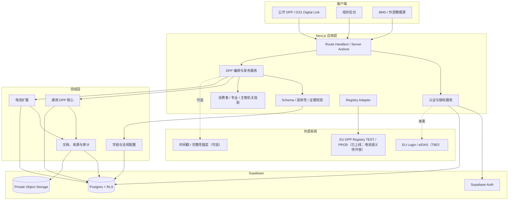
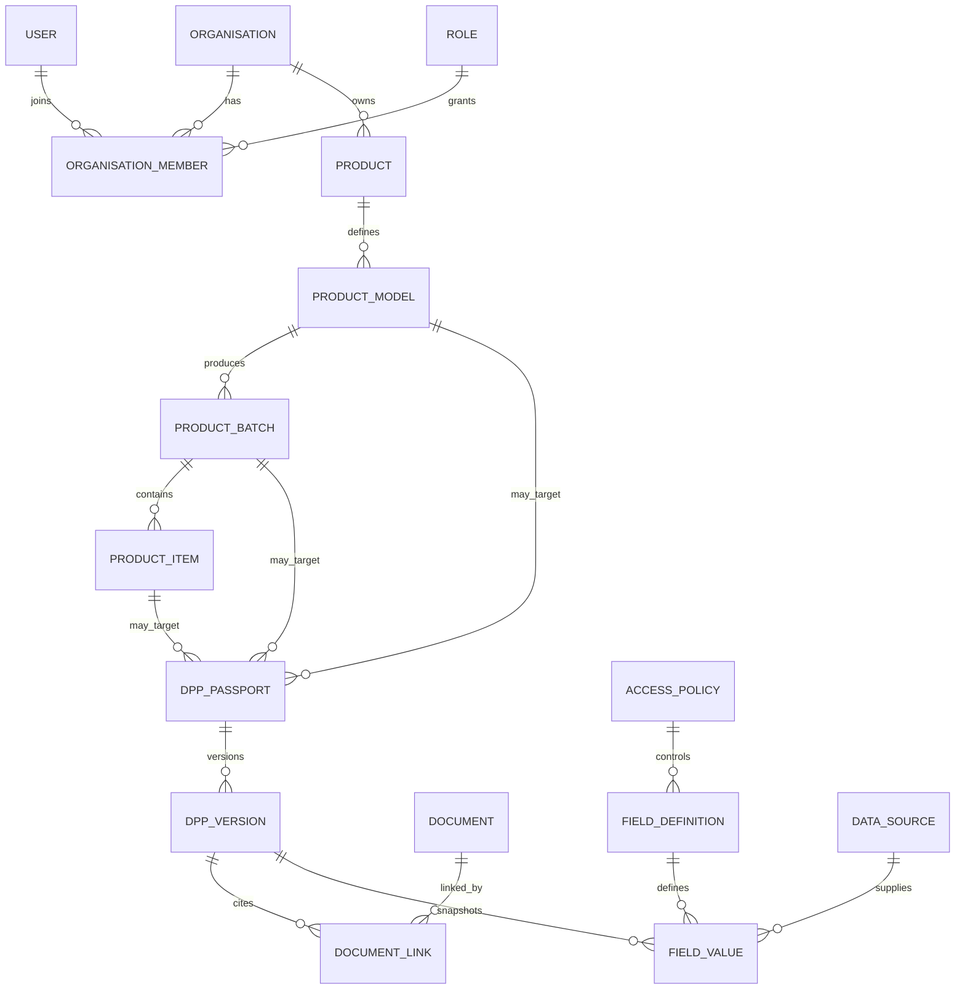
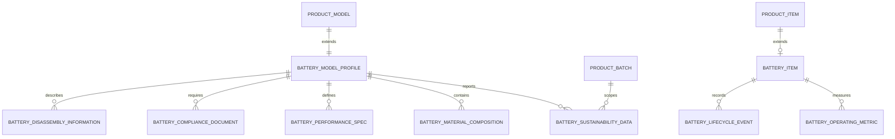
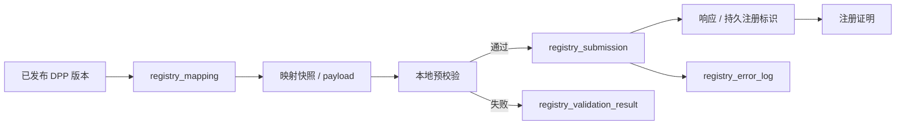
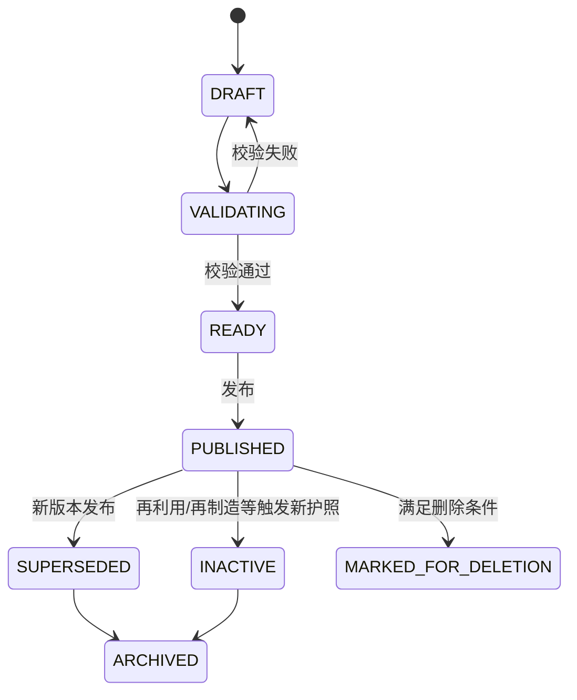
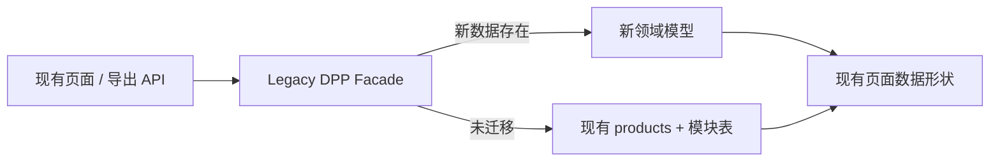

# Greanlean 目标架构

版本：Phase 2 / target-architecture  
状态：待确认  
日期：2026-07-22

## 1. 架构目标

目标架构在保留现有 Next.js、Supabase 和 Vercel 技术栈的前提下，建立清晰的服务端边界、领域模型、多租户权限、版本化字段字典、电池动态数据和 Registry 适配能力。

核心原则：

- DPP 是独立于产品页面的版本化数字资产；
- 产品、型号、批次和单体是不同对象；
- 通用 DPP 与电池 DPP 采用核心模型加扩展模型；
- 字段定义、字段值、证据和法规来源相互关联但不混为一表；
- 所有权限由服务端执行；
- Registry 是适配层，不是 Greanlean 的主数据源；
- 动态数据只追加，不覆盖；
- 迁移先新增、后切换，旧功能通过兼容层继续运行。

## 2. 总体分层

## 3. 运行边界

### 3.1 客户端

客户端只负责表单交互、局部校验、进度显示和渲染。所有创建、更新、发布、权限判断、文件签名 URL 和 Registry 操作均经服务端接口执行。

现有直接调用 Supabase 的组件在迁移期保留，但新电池模块不得继续复制该模式。

### 3.2 应用服务

建议按领域建立以下服务：

| 服务 | 职责 |
|---|---|
| `OrganisationService` | 组织、成员、角色和邀请 |
| `ProductCatalogService` | 产品、型号、批次、单体 |
| `IdentifierService` | UPI、型号、批次、序列号、GTIN、解析 URI 和数据载体 |
| `SchemaService` | Schema 版本、字段、适用性、校验、codelist 和法规来源 |
| `BatteryPassportService` | 电池静态数据、动态指标和生命周期事件 |
| `EvidenceService` | 上传、Hash、文档版本、访问策略和字段证据关联 |
| `DppVersionService` | 草稿、快照、发布、归档、Hash 和版本链 |
| `AccessProjectionService` | 基于角色和访问策略生成可见数据投影 |
| `RegistryService` | 映射、预校验、环境隔离、提交记录、错误和证明 |
| `AuditService` | 追加写入审计日志和 correlation id |

### 3.3 数据层

- Supabase Postgres 保存结构化主数据、Schema、字段值、版本、日志和 Registry 记录；
- Supabase Storage 或等价私有对象存储保存原始证明文件；
- RLS 按 `organisation_id` 和成员角色执行；
- 公开查询只能读取已发布 DPP 的服务端投影，不直接查询所有底层表；
- 动态指标和审计日志采用 append-only 策略；
- 数据库变更只通过编号化迁移执行。

## 4. 领域对象

### 4.1 通用核心

对象职责：

| 对象 | 说明 |
|---|---|
| `organisation` | 数据所有者和租户边界 |
| `user` | Supabase Auth 用户档案 |
| `role` | 平台及组织角色 |
| `product` | 市场产品族，不承载所有电池字段 |
| `product_model` | 设计和规格层 |
| `product_batch` | 生产批次、时间和工厂层 |
| `product_item` | 有序列标识的物理单体 |
| `dpp_passport` | 与型号、批次或单体绑定的护照身份 |
| `dpp_version` | 不可覆盖的发布快照和 Hash |
| `unique_identifier` | 统一管理产品、型号、批次、单体、运营者和设施标识 |
| `data_carrier` | 二维码、NFC、RFID 与解析 URI |
| `document` | 受控文件元数据和 Hash |
| `data_source` | 人工、供应商、实验室、BMS、系统派生等来源 |
| `access_policy` | 字段和文档的服务端访问规则 |
| `audit_log` | 不可修改的操作日志 |

### 4.2 电池扩展

关键边界：

- `battery_model_profile` 保存类别、化学体系、BMS 变体和型号基础属性；
- `battery_performance_spec` 保存额定容量、标称电压、功率、预期寿命等静态规格；
- `battery_sustainability_data` 支持型号或“型号 + 日历年 + 制造场所”的批次粒度；
- `battery_item` 只保存单体扩展身份和当前生命周期状态，不保存覆盖式运行历史；
- `battery_operating_metric` 保存 22 类动态属性及后续可配置指标；
- `battery_lifecycle_event` 保存投放、维修、再利用、再制造、再用途、事故、回收和报废事件；
- 材料、合规文件和拆卸信息可被 DPP 版本引用并根据访问策略投影。

### 4.3 字段配置

| 对象 | 作用 |
|---|---|
| `schema_definition` | 某产品组/技术变体的逻辑 Schema |
| `schema_version` | 可发布、可归档的 Schema 版本 |
| `field_definition` | 字段编码、类型、单位、粒度、访问和展示信息 |
| `validation_rule` | 类型、范围、格式、codelist、跨字段和证据规则 |
| `applicability_rule` | 电池类别、技术变体、粒度和条件必填规则 |
| `regulatory_reference` | 法规、条款、标准、草案状态和来源版本 |
| `access_level` | 四类平台访问等级代码 |
| `access_policy` | 具体允许角色、组织、目的和时间限制 |
| `field_value` | 配置字段值、来源、验证和证据状态 |

Schema 版本发布后不可修改。修订字段、规则或 codelist 时创建新版本，并通过迁移映射说明旧字段如何升级。

### 4.4 Registry 适配

截至 2026-07-22，Registry 与测试环境已经上线，实施依据为 Regulation (EU) 2026/1778。官方 Economic Operators User Guide v1.0 说明当前电池语义目录尚未定义，电池注册请求不能成功完成。适配层必须把系统可访问状态、组织验证状态、产品组语义可用状态和单次提交状态分开记录。

对象职责：

| 对象 | 说明 |
|---|---|
| `registry_mapping` | Greanlean 字段到 Registry 字段的版本化规则 |
| `registry_submission` | 一次提交或人工上传记录 |
| `registry_validation_result` | 请求前和 Registry 返回的字段级校验结果 |
| `registry_error_log` | 可解析、可重试的错误记录 |
| `registry_registration_proof` | 注册证明、Hash、签章和有效期元数据 |

`TEST` 与 `PRODUCTION` 使用不同凭据引用、端点配置、提交序列和状态，不允许将测试注册标识写入生产记录。

## 5. DPP 版本与发布

发布事务必须同时完成：

1. 锁定待发布草稿；
2. 运行 Schema、适用性、证据和权限校验；
3. 生成规范化完整快照；
4. 计算快照 Hash 和证据清单 Hash；
5. 写入 `dpp_version`；
6. 更新护照当前版本指针；
7. 写入审计日志；
8. 事务提交后再触发 Registry 映射和外部锚定。

## 6. 访问投影

公开页不再通过 `?view=` 直接决定权限。服务端根据访问上下文生成投影：

| 投影 | 身份要求 | 数据范围 |
|---|---|---|
| Consumer | 无 | `PUBLIC` 字段和公开文档 |
| Professional | 已认证且满足合法利益策略 | `PUBLIC` + 获批 `LEGITIMATE_INTEREST` |
| Authority | 已验证主管机关角色 | `PUBLIC` + 获批受限字段 + `AUTHORITY_ONLY` |
| Internal | 同组织授权用户 | 按内部角色和职责读取 `INTERNAL` |

后台“预览不同角色”使用模拟投影，只能由组织内授权用户使用，并明确标记为预览；不能通过改 URL 获得真实权限。

## 7. 标识与数据载体

`unique_identifier` 统一保存：

- 标识主体：产品、型号、批次、单体、DPP、组织、运营者、设施；
- 标识方案：GTIN、内部 ID、Registry ID、未来标准标识方案等；
- 原始值、规范化值、URI、签发机构、状态、有效期；
- 是否持久、是否主标识、替代和撤销关系。

`data_carrier` 保存：

- 类型：QR、Data Matrix、NFC、RFID；
- 编码内容和解析 URI；
- 关联唯一标识；
- 载体位置：产品、包装或随附文档；
- 状态、生成时间和校验结果。

现有 GS1 Digital Link 能力保留，是否作为所有产品组的唯一实现由后续标准和产品组规则确认。

## 8. 安全架构

- Supabase Auth 只负责身份认证，组织成员关系和业务角色由数据库管理；
- 服务端从会话解析 `user_id`，不得信任客户端提交的 `organisation_id`；
- RLS 对组织表、产品表、字段值、文件、版本和 Registry 记录执行租户隔离；
- Storage bucket 默认私有，通过短期签名 URL 和访问服务授权；
- Registry 凭据、服务角色密钥和签章密钥只在服务端密钥管理中引用；
- 日志避免写入原始凭据、个人数据和完整敏感 payload；
- 发布、权限变更、文件替换、Registry 提交和锚定均记录审计日志；
- 审计和动态指标删除仅允许受控保留策略任务执行。

## 9. 兼容架构

迁移期增加兼容读取层：

- 现有表先保留，不在首轮迁移中重命名或删除；
- 每个现有产品建立默认 `product_model`，并按现有粒度建立 DPP；
- 公开页通过 facade 读取新旧数据，避免一次性重写大型组件；
- 新电池功能只写新表，必要时通过受控同步写入旧展示字段；
- 迁移完成并经过回归测试后，旧表才进入只读和延迟废弃阶段。

## 10. 部署拓扑

| 环境 | Git | Vercel | Supabase | Registry |
|---|---|---|---|---|
| Local | `feature/battery-dpp` | 本地 Next.js | 开发项目/本地副本 | mock/file |
| Preview | 功能分支 | Preview deployment | 测试项目 | TEST 或 mock |
| Staging | 受保护集成分支 | Staging | 独立 staging | TEST |
| Production | `main` | Production | 生产项目 | PRODUCTION（已上线；电池自动提交默认关闭） |

数据库迁移必须先通过 Local 和 Staging；Vercel Preview 不得连接生产写库。

## 11. 高风险区域

| 风险 | 处理方式 |
|---|---|
| 旧页面依赖扁平数据 | facade + 双读 + 契约测试 |
| RLS 从全体 authenticated 改为组织隔离 | 先建立成员数据并运行权限矩阵测试，再收紧策略 |
| 产品拆分为型号/批次/单体 | 先为每个现有产品生成默认型号，保留原 ID 映射 |
| BatteryPass 草案变化 | Schema 版本化，不把规则硬编码进组件 |
| Registry 操作规范和电池语义目录变化 | 适配器 + mapping version，不把当前 UI/文件结构硬编码为永久 API |
| 动态数据量增长 | 分区/索引策略和归档策略，禁止写入通用字段表 |
| 文件访问泄露 | 私有 bucket + 服务端签名 URL + 文档访问策略 |

## 12. 回滚原则

- 每个迁移有 `up` 和 `down`，但数据回填后的回滚优先切换功能开关，不立即删除新数据；
- 旧表在至少一个稳定发布周期内保持可读；
- 新读取路径通过 feature flag 按组织启用；
- Registry 适配失败不影响已发布 DPP 访问；
- 动态数据和审计日志不因应用回滚而删除；
- 生产回滚恢复到上一应用版本和兼容读取层，数据库使用向后兼容迁移。
