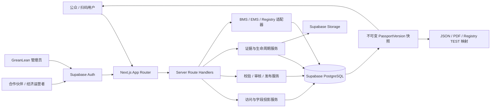
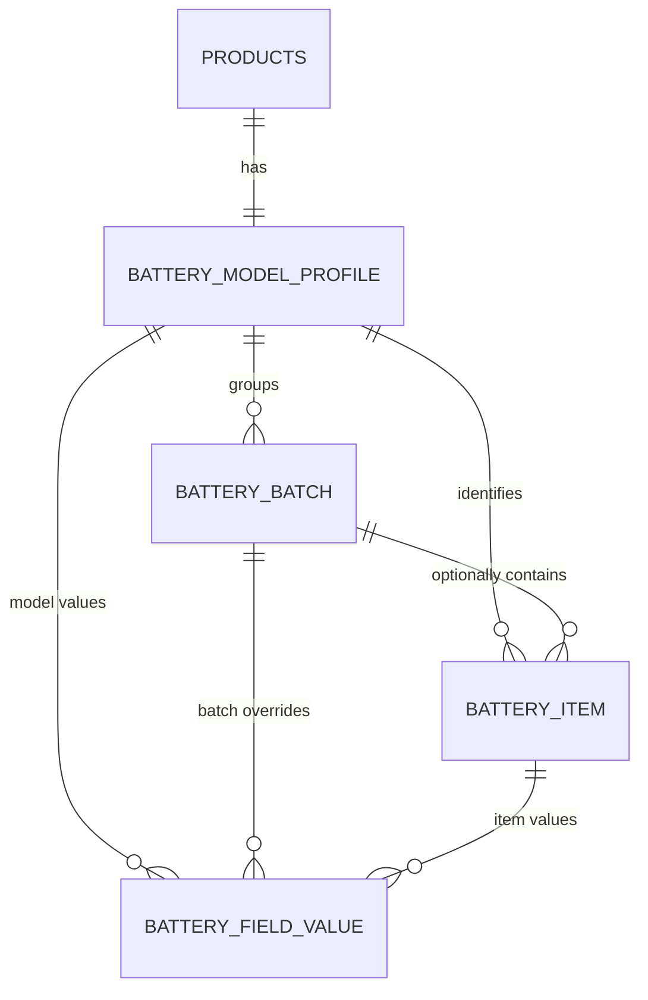

# Current Architecture

## 1. 系统边界

## 2. 应用层

- `app/page.tsx`：中英文官网与四个 DPP 案例入口。
- `app/p/[slug]/page.tsx`：统一公开/授权 DPP 页面。
- `app/dashboard/*`：后台首页、产品中心、导入、供应商、访问审批、客户提交。
- `app/api/internal/*`：产品字段写入、发布、证据、生命周期和完整性操作。
- `app/api/dpp-access/*` 与 `dpp-files/*`：授权投影与证据下载。
- `app/api/integrations/*`：设备凭据、运行数据和事件接入。
- `app/api/registry/*`：Registry TEST/Mock 工作区与导出。

## 3. 领域层

| 模块 | 主要实现 |
| --- | --- |
| DPP 公开读取 | `lib/dpp/publicDppRepository.ts` |
| canonical 兼容投影 | `lib/dpp/canonicalLegacyProjection.ts` |
| 授权与审计 | `lib/server/dppAccess.ts` |
| 发布候选 | `lib/server/dppPublicationCandidate.ts` |
| 校验/审批/发布 | `lib/server/dppPublicationWorkflow.ts` |
| 证据文件 | `lib/server/dppFileRepository.ts` |
| 电池工作区 | `lib/server/batteryRepository.ts` |
| 动态运行数据 | `lib/server/batteryOperatingData.ts` |
| BatteryPass | `lib/battery/batteryPass.ts`、`lib/server/batteryPassRepository.ts` |
| Registry | `lib/server/registryRepository.ts` |

## 4. 数据层

### 核心与行业模板

- `products` 是现有多行业聚合根。
- `dpp_category_profiles`、`dpp_field_templates` 是旧行业模板。
- `schema_definition`、`schema_version`、`field_definition`、适用规则是新版 Schema Registry。

### 电池层级

当前关系在应用层可用，但数据库组合一致性和组织内唯一性仍需 P0 加固。

### 发布与证据

- `dpp_publication_review` 保存不可变候选和校验决策。
- `dpp_publication` 保存不可变完整快照和 SHA-256。
- `dpp_product_publication_pointer` 指向每个产品当前发布版本。
- `dpp_file_asset` / `dpp_file_version` / `dpp_file_link` 保存证据、版本和字段范围。
- `dpp_lifecycle_event`、运行数据、Registry 回执和完整性锚点均采用追加记录。

## 5. 权限模型

- 身份：Supabase Auth user。
- 租户/角色：`dpp_organisation` + `dpp_user_membership`。
- 资源授权：`dpp_product_access_grant`，支持产品或行业范围。
- 字段等级：`PUBLIC`、`LEGITIMATE_INTEREST`、`AUTHORITY_ONLY`、`INTERNAL`。
- 服务端：页面/API/导出/文件先解析身份和产品授权，再调用数据库投影。
- 平台操作：发布、Registry、系统回执和管理员写入由 service role 服务器边界执行。

## 6. 发布数据流

1. 编辑源表形成草稿状态。
2. 服务端聚合九个 canonical 模块并计算 source fingerprint。
3. 创建 review candidate，执行 blocker/warning 校验。
4. 管理员批准后写入不可变 `dpp_publication`。
5. 当前指针切换到新版本，旧版本保留并被标为 superseded。
6. 页面、JSON、PDF 和 Registry 映射读取当前发布版本及访问等级投影。

## 7. 部署与运维

- Vercel 运行 Next.js；Supabase 提供数据库、Auth 和 Storage。
- 环境变量分公开配置和服务器机密；Registry 与新能力均有 Feature Flag。
- SQL 迁移目前以编号文件、rollback 和可粘贴 bundle 交付；生产应用仍需人工确认 verify 结果。
