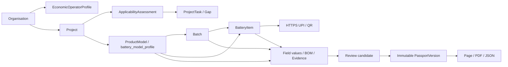

# P0 Technical Design

## 1. 目标

在不重写现有多行业 DPP、四个公开案例和 canonical publication 的前提下，完成电池 P0 的最小闭环：组织与经济运营者、项目与适用性、Model-Batch-Item、单体 UPI、字段继承/校验、证据门禁、单体发布主体、同源输出和基础批量导入。

## 2. 目标主线

## 3. 兼容策略

- `products` 继续作为多行业产品聚合根；`battery_model_profile` 是电池 ProductModel 的实际映射。
- 新增 `dpp_product_ownership`，避免直接给所有历史 `products` 猜测 organisation。
- 新建 P0 项目必须绑定 organisation；历史无归属产品仍可按既有别名和 `/p/[slug]` 公开读取，但后台层级接口仍要求产品 `INTERNAL` 授权。
- 现有 product 级 publication 保留。迁移对 `dpp_publication` 增加可空 `battery_item_id`/`organisation_id` 和 subject 约束，新增 item pointer；历史行默认 `PRODUCT`。
- 公开页面继续使用现有路由；item UPI 可映射到同一产品页面并解析指定 item。旧 DPP ID 和 alias 不失效。

## 4. 数据设计

### 4.1 新增表

- `dpp_economic_operator_profile`：版本化经济运营者资料。
- `dpp_product_ownership`：产品唯一 owning organisation，支持 legacy/unassigned 分类。
- `dpp_project`：项目、范围、负责人、日期、状态、版本。
- `dpp_applicability_assessment`：问卷输入、规则版本、初步结果、待确认、免责声明。
- `dpp_project_task`：适用性缺口、证据、数据和验收任务。
- `dpp_identifier`：Model/Batch/Item 类型化标识，UPI 全局唯一、HTTPS、退役保留。
- `dpp_import_job`、`dpp_import_error`：预检/导入摘要和行字段错误。
- `dpp_item_publication_pointer`：每个 BatteryItem 当前不可变发布版本。

### 4.2 扩展表

- `dpp_organisation`：display name、tenant slug、registered address、default locale、row version。
- `battery_model_profile`：organisation/project、model status、inheritance version、demo marker、row version。
- `battery_batch`：organisation、status、允许覆盖 JSON、组合唯一键。
- `battery_item`：organisation、item code、placed-on-market、P0 status、source、row version。
- `dpp_publication`/review：organisation、battery item、subject type、change reason。

### 4.3 关键约束

- 新 P0 资源必须有 organisation；历史空 organisation 行允许只读兼容。
- 同 organisation 的 `battery_model_identifier` 唯一；同 organisation 的 serial 唯一。
- Project 子资源以及 Batch、Item 的 product/model/organisation 必须一致；组合外键和触发器共同拒绝跨组织错链；item.batch 必须属于同 model。
- UPI 是 HTTPS URL、normalized value 全局唯一；UPI 退役不删除。
- 批量创建最多 100 行，整批预检后事务写入；幂等键重复返回原结果。
- item publication 的版本号在 item 内唯一且只有一个 current pointer。

## 5. 服务设计

- 所有 `/api/v1/*` 先执行 Supabase bearer token 校验，再由数据库身份函数取得 organisation/role。
- 列表和对象读取同时限制 organisation + resource ID；platform admin 也必须显式选择 organisation context。
- 数据库错误只写服务器日志；客户端返回固定错误码和 request id。
- P0 API 使用现有 `ApiError`/`apiRoute` 响应风格，保留当前 API 兼容；数据库原始消息不进入客户端 details。
- 适用性规则输出为 `PRELIMINARY_APPLICABLE/PENDING/INSUFFICIENT/NOT_APPLICABLE`，绝不返回法律认证。

## 6. 发布与同源输出

- 发布候选明确 `subject.type` 和 `batteryItemId`。
- item publication snapshot 包含解析后的 Model + Batch + Item 值及继承来源摘要；动态 BMS 历史不进入静态快照。
- 页面、PDF、canonical JSON 都从同一 publication snapshot 生成，返回一致的 version/publishedAt/hash。
- canonical-to-legacy 对新版本仅用 snapshot 内发布字段；live product 只用于路由解析和历史无完整 presentation 快照的兼容回退，后者记录为剩余风险。

## 7. UI 设计

- 首页增加电池适用性初评和单型号试点入口，结果明确“初步判断/待确认”，不写入项目数据库。
- 后台增加“项目”与“组织资料”，项目详情用概览、适用性、产品层级、缺口任务四区。
- 产品编辑保留现有五阶段；电池数据阶段增加 Batch/Item 层级、继承来源、批量创建和 UPI 状态。
- 公开案例 fixture 显示 `DEMO/SYNTHETIC` 数据边界；客户数据不自动替换为合成数据。

## 8. 功能边界

- P0 页面和 API 随应用版本发布，但只有安装迁移 0025 且具有服务器端权限的账号可写入。
- Registry 继续依靠现有环境字段、发布映射和服务端权限限制在 TEST/Mock 边界；本轮没有新增或声称存在生产开关。
- 区块链仍沿用现有可选连接器骨架，不作为发布门禁，本轮不启用外部网络。

## 9. 可观测性

- 写操作返回/记录 request id；批量导入保留幂等键、行数和错误。
- 发布、BOM 导入以及既有文件/访问操作记录不可变审计；项目、档案和适用性通用操作审计仍是 P1 加固项。
- 迁移 verify 报告表数、约束、策略、函数和遗留冲突数。
