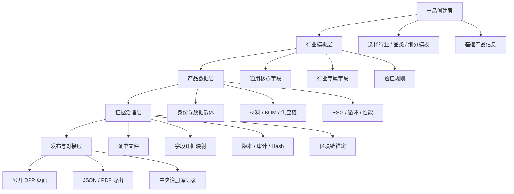
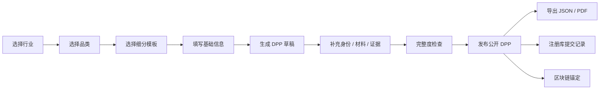
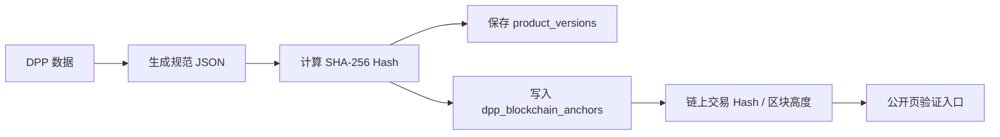
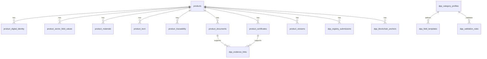

# GreanLean DPP 产品规划手册

版本：v0.1  
日期：2026-07-17  
适用阶段：公开展示 + 企业后台 + 欧盟 DPP 合规准备

## 1. 产品定位

GreanLean DPP 是面向出口欧盟企业的数字产品护照平台。平台不应该只是一个“产品资料展示页”，而应该是一个围绕产品唯一身份、法规字段、证据文件、版本治理和数据对接的合规数据工作台。

第一阶段的目标不是把所有字段一次填满，而是建立一套清晰、可扩展、能接中央注册库和未来行业法规模板的数据底座。

### 1.1 一句话定义

帮助企业把产品资料、供应链数据、检测证据、碳与循环信息整理成可公开展示、可审计、可导出、可注册的欧盟 DPP 数据资产。

### 1.2 当前优先服务对象

- 中国出口欧盟制造商
- 品牌方 / 贸易商
- 需要对接欧盟 DPP、ESPR、电池护照、客户 ESG 要求的企业
- 需要把分散的 Excel、PDF、检测报告、供应商声明变成结构化数据的团队

### 1.3 平台必须解决的核心问题

| 问题 | 平台要给出的能力 |
|---|---|
| 产品资料分散在 Excel、PDF、邮件、微信里 | 统一产品资料后台 |
| 不同行业法规字段不同 | 行业模板 + 子类字段配置 |
| 企业不知道哪些字段必须填 | Readiness check / 字段完整度 |
| 检测报告和声明文件容易混乱 | 文件库 + 字段证据映射 |
| 二维码需要符合 GS1 逻辑 | GTIN / 批次 / 序列号 / Digital Link |
| 公开页面不能暴露全部内部数据 | 字段可见性控制 |
| 数据修改后需要可追溯 | 版本历史 + 审计日志 |
| 需要不可篡改证明 | 数据 Hash + 区块链锚定 |
| 将来要对接中央注册库 | 注册库字段 + 提交记录 + 注册证明 |

## 2. 产品边界

### 2.1 平台应该做什么

- 创建和维护产品 DPP
- 按行业选择字段模板
- 管理产品唯一标识、GS1 Digital Link 和数据载体
- 录入材料、BOM、供应链、ESG、循环性、证书、文件
- 建立字段与证据文件之间的映射
- 生成公开 DPP 页面
- 提供 JSON / PDF 导出
- 记录版本、审计日志和 Hash
- 保存中央注册库提交记录
- 预留区块链锚定能力

### 2.2 平台暂时不应该做什么

- 不直接替代检测机构出具官方报告
- 不自动生成虚假的合规声明
- 不把所有行业字段硬编码进产品主表
- 不把公开页面当成完整后台
- 不在公开页暴露内部供应商联系人、成本、账号、草稿记录
- 不在第一阶段做复杂多租户权限，除非客户账户体系已经明确

## 3. 总体信息架构

系统应分成五层，而不是把所有内容都塞到“产品详情”里。



## 4. 行业分类策略

后台创建 DPP 的第一步必须先选行业，因为行业决定字段模板、必填项、证据要求和未来注册逻辑。

### 4.1 第一阶段行业范围

| 顶层行业 | sector_code | 说明 |
|---|---|---|
| 电池 | `battery` | 对齐 BatteryPass / 欧盟电池法规 |
| 纺织 | `textile` | 面料、服装、纤维组成、化学合规、耐久性 |
| 家具 | `furniture` | 材料、耐久性、维修、拆解、循环 |
| 建材 | `construction` | 性能声明、安装、VOC/REACH、循环 |
| 消费电子 | `consumer_electronics` | RoHS/REACH、电池安全、维修、软件、WEEE |

### 4.2 电池子分类

电池不是一个单一模板。选择“电池”之后，必须继续选择下一级分类。

| 子分类 | category_code | profile_key |
|---|---|---|
| 电动车电池 | `ev_battery` | `battery.ev.unit.v1` |
| LMT 电池 | `lmt_battery` | `battery.lmt.unit.v1` |
| 无 BMS 工业电池 | `industrial_without_bms` | `battery.industrial.without_bms.v1` |
| 其他 2kWh 以上工业电池 | `industrial_other_above_2kwh` | `battery.industrial.other_above_2kwh.v1` |
| 2kWh 以上固定式工业电池 | `industrial_stationary_above_2kwh` | `battery.industrial.stationary_above_2kwh.v1` |

### 4.3 字段设计原则

所有产品共有的字段放在 `products` 或通用模块表里。行业差异字段不进入 `products` 主表，而是进入：

- `dpp_category_profiles`
- `dpp_field_templates`
- `dpp_validation_rules`
- `product_sector_field_values`

这样后续新增鞋类、玩具、包装、钢铁、化学品时，不需要重构产品主表。

## 5. 产品创建流程

### 5.1 推荐后台流程



### 5.2 创建草稿时只需要最少字段

为了降低创建门槛，创建 DPP 草稿不应要求企业一次性填写所有合规字段。

最少字段：

- 行业
- 产品类别
- 细分模板
- 产品名称
- SKU / 型号
- 品牌
- DPP ID 或系统自动生成

创建后再进入详情页补充：

- GS1 / GTIN / Digital Link
- 材料和 BOM
- 证据文件
- 行业专属字段
- ESG 和循环数据
- 中央注册库字段
- 区块链锚定记录

## 6. 后台模块规划

### 6.1 当前后台应该整理成 8 个主模块

| 模块 | 目的 | 页面建议 |
|---|---|---|
| 工作台 | 查看待办、草稿、过期证书、发布状态 | `/dashboard` |
| 产品中心 | 创建和管理 DPP | `/dashboard/products` |
| 产品详情 | 录入单个产品完整 DPP 数据 | `/dashboard/products/[id]` |
| 批量导入 | 从 Excel / CSV 导入产品和模块数据 | `/dashboard/import` |
| 供应商库 | 管理供应商与产品关系 | `/dashboard/suppliers` |
| 证据中心 | 统一管理证书、报告、声明文件 | 后续新增 |
| 注册库中心 | 管理中央注册库提交、状态、证明 | 后续新增 |
| 系统设置 | 行业模板、字段模板、权限、企业信息 | 后续新增 |

### 6.2 产品详情页应拆成三层

#### 第一层：注册库与唯一身份

目的：保证产品能被唯一识别、扫描、注册和验证。

包含：

- DPP ID
- Public slug
- GTIN
- batch ID
- serial ID
- UPI
- GS1 Digital Link
- data carrier type
- data carrier URL
- 中央注册库提交
- 注册证明
- 版本历史

#### 第二层：行业模板与合规数据

目的：按行业填字段，而不是所有产品共用一套字段。

包含：

- 行业专属字段
- 材料
- BOM / 包装 / 组件
- 供应链追溯
- ESG
- 循环性
- 产品性能
- 消费者透明信息

#### 第三层：证据、治理与不可篡改记录

目的：证明数据从哪里来、谁改过、是否被锚定。

包含：

- 证书
- 文件
- 字段证据映射
- 数据治理
- 审计日志
- 区块链锚定

## 7. 公开 DPP 页面规划

公开 DPP 页面不是后台的复制版，而是给不同读者看的“可信产品资料页”。

### 7.1 公开页读者

| 读者 | 关注点 |
|---|---|
| 欧盟监管方 | 唯一标识、商品编码、合规字段、证据状态 |
| 品牌客户 | 材料、供应链、证书、碳数据、版本 |
| 终端消费者 | 产品来源、环保信息、维修回收说明 |
| 回收 / 维修机构 | 材料、拆解、危险物质、回收路径 |

### 7.2 公开页模式

建议保留两种视图：

- 简易版：给消费者和销售展示
- 详细版：给客户、审核、监管准备

### 7.3 公开页不展示内容

- 草稿产品
- 内部审计明细
- 未公开供应商联系方式
- 管理员备注
- 未验证的敏感证据
- 区块链私钥或内部签名材料

## 8. 中央注册库对接规划

### 8.1 中央注册库在系统里的定位

中央注册库不是完整 DPP 数据库。平台应把完整产品护照数据保存在自己的系统中，中央注册库记录的是能索引和定位 DPP 的核心识别信息和提交状态。

当前系统需要预留：

- DPP ID
- Unique product identifier
- GTIN / batch / serial
- commodity code
- granularity level
- DPP URL
- submitted hash
- submitted version
- semantic model version
- registry response
- registration proof

### 8.2 注册库相关模块

| 数据 | 表 |
|---|---|
| 产品核心注册字段 | `products` |
| 提交记录 | `dpp_registry_submissions` |
| 注册证明 | `dpp_registration_proofs` |
| 数字身份与数据载体 | `product_digital_identity` |
| 导出 JSON | `/api/dpp-export` |

### 8.3 关键原则

- 注册库提交的是某一版本 DPP 的摘要和索引，不是后台草稿。
- 每次提交必须对应一个 `product_versions` 版本。
- 提交前必须生成稳定 Hash。
- 注册库返回结果要保存原始响应，方便追溯。
- 注册失败不能覆盖旧的已接受版本。

## 9. GS1 与二维码规划

二维码不应该只是普通 URL，而应尽量对齐 GS1 Digital Link 思路。

### 9.1 推荐结构

基础路径：

```text
/01/{gtin}
```

批次级：

```text
/01/{gtin}/10/{batch}
```

单品级：

```text
/01/{gtin}/10/{batch}/21/{serial}
```

### 9.2 数据载体字段

| 字段 | 含义 |
|---|---|
| `gtin` | 商品贸易项目编号 |
| `batch_id` | 批次号 |
| `serial_id` | 序列号 |
| `digital_link_url` | GS1 Digital Link 或平台解析链接 |
| `data_carrier_type` | QR / NFC / RFID / DataMatrix |
| `data_carrier_url` | 数据载体实际解析 URL |
| `qr_code_id` | 二维码内部 ID |
| `nfc_id` | NFC 标签 ID |
| `rfid_epc` | RFID EPC |

### 9.3 产品粒度

| 粒度 | 使用场景 |
|---|---|
| model | 型号级产品资料，例如家具、建材常见 |
| batch | 批次级资料，例如纺织、原料、生产批次 |
| item | 单品级资料，例如电池、高价值产品、序列化电子产品 |

## 10. 区块链与不可篡改记录规划

区块链不要一开始做成复杂链上系统。第一阶段应该做“链下数据 + 链上 Hash 锚定”。

### 10.1 推荐架构



### 10.2 不建议

- 不把全部 DPP 数据上链
- 不把 PDF 文件直接上链
- 不把个人信息、供应商敏感信息上链
- 不用区块链替代数据库权限和审计

### 10.3 应该实现

- 每个已发布版本生成 Hash
- Hash 与版本号绑定
- Hash 与证据文件 Hash 关联
- 锚定记录可展示为“已锚定 / 待锚定 / 失败”
- 支持区块浏览器 URL

## 11. 证据链规划

平台最核心的可信度来自“字段有证据”，而不是页面写得漂亮。

### 11.1 证据类型

| 类型 | 例子 |
|---|---|
| certificate | GRS、OEKO-TEX、FSC、CE |
| test_report | REACH、SVHC、RoHS、PFAS、VOC |
| declaration | 供应商声明、材料声明、符合性声明 |
| lca_report | 碳足迹、生命周期评价 |
| photo | 产品图、标签图、包装图 |
| dataset | Excel、ERP 导出、BOM 表 |
| registry_proof | 中央注册库证明 |
| blockchain_anchor | 区块链锚定记录 |

### 11.2 字段证据映射

每个关键字段最好能回答：

- 这个值从哪里来？
- 证据文件是哪一个？
- 谁上传 / 谁验证？
- 是否公开？
- 是否过期？
- 是否被纳入版本 Hash？

对应表：

- `product_certificates`
- `product_documents`
- `dpp_evidence_links`
- `product_data_governance`

## 12. 数据状态与版本规划

### 12.1 产品生命周期

| 状态 | 说明 |
|---|---|
| draft | 草稿，不公开 |
| review | 待审核，不公开 |
| published | 已发布，公开 |
| updated | 已更新，公开 |
| archived | 已归档，不公开 |
| expired | 证书或数据过期，仍可访问但提示风险 |

### 12.2 版本规则

- `v1.0`：首次发布
- `v1.1`：补证书、补文件、修正小字段
- `v1.2`：更新碳数据、供应商声明、检测报告
- `v2.0`：产品配方、BOM、供应链、批次逻辑发生重大变化

### 12.3 每次发布应固化

- DPP JSON
- 数据 Hash
- 证据文件 Hash
- 发布时间
- 发布人
- 注册状态
- 区块链锚定状态

## 13. 权限与账户规划

### 13.1 第一阶段

当前可以先保持一个 admin workspace，但后台界面和数据结构要为多企业预留。

### 13.2 后续角色

| 角色 | 权限 |
|---|---|
| platform_admin | 管理所有企业、模板、系统设置 |
| company_admin | 管理本企业产品、用户、发布 |
| editor | 创建和编辑草稿 |
| reviewer | 审核和发布 |
| supplier | 补充供应商资料和证据 |
| auditor | 查看证据、版本、审计日志 |
| public_user | 只能看公开 DPP |

### 13.3 后续需要新增

- `companies`
- `company_users`
- `product_company_id`
- RLS 按企业隔离
- 操作日志记录 actor

## 14. 当前系统主要问题

这是下一步整理的依据。

### 14.1 后台问题

- 产品详情页模块太多，用户容易不知道先填什么。
- 行业字段和通用字段仍然混在视觉上。
- 证书、文件、证据映射还没有形成一个“证据中心”。
- 创建产品时体验已经改善，但后续补资料仍缺少任务引导。
- 没有完整度检查，用户不知道 DPP 是否可以发布。

### 14.2 数据问题

- 公开页仍有部分 demo fallback 逻辑，容易和数据库真实数据混淆。
- 化学合规和性能模块目前部分由页面/API 生成，建议独立建表。
- 行业字段模板已有基础，但还没有动态表单自动渲染。
- 证据 Hash、版本 Hash、区块链锚定之间还没有形成自动流程。

### 14.3 合规问题

- 中央注册库现在只是字段预留，还没有提交包生成流程。
- GS1 Digital Link 需要进一步规范校验。
- 字段必填和证据必填规则还没有形成 readiness score。
- 不同公开对象看到哪些字段，还需要 visibility 规则。

## 15. 产品路线图

### Phase 1：整理地基

目标：让系统不乱，创建和维护 DPP 有清晰结构。

要做：

- 固定五个行业入口
- 完成行业模板基础表
- 产品详情页按三层结构整理
- 补齐数据载体字段
- JSON schema 与数据库字段对齐
- 写产品规划手册和数据模型手册

验收：

- 新建产品先选行业
- 电池可选择 5 个子分类
- 产品详情页能看出注册库、行业字段、证据治理三层
- 构建通过

### Phase 2：字段模板驱动表单

目标：不同产品显示不同字段。

要做：

- 根据 `dpp_field_templates` 自动渲染行业字段表单
- 支持必填、单位、字段说明、证据要求
- 支持字段完整度检查
- 支持按 profile 初始化字段值
- Battery 字段优先参考 BatteryPass-Ready

验收：

- 选择电池 EV 后出现电池字段
- 选择纺织面料后出现纤维、化学、耐久字段
- 不再需要手动输入 field_key

### Phase 3：证据中心

目标：把文件管理从产品详情里抽出来，形成可信证据库。

要做：

- 新增证据中心页面
- 文件上传到 Supabase Storage
- 自动计算文件 Hash
- 证据文件绑定字段
- 证据状态：declared / pending / verified / expired
- 文件过期提醒

验收：

- 点击某个字段能看到支撑文件
- 化学声明和测试报告必须打开真实上传文件
- 不再默认打开系统生成 demo 文件

### Phase 4：发布与版本治理

目标：每次发布都能追溯。

要做：

- 发布按钮与草稿保存分离
- 发布时生成 DPP JSON 快照
- 自动计算版本 Hash
- 保存 version snapshot
- 公开页只读取已发布版本
- 支持回滚查看旧版本

验收：

- 草稿修改不会立即影响公开页
- 已发布版本有 Hash
- 公开页能显示版本号和更新时间

### Phase 5：GS1 / 中央注册库准备

目标：具备对接中央注册库的提交包基础。

要做：

- GTIN 格式校验
- Digital Link 生成与解析
- 注册库提交 payload 生成
- 提交状态记录
- 注册证明文件绑定
- registry readiness checklist

验收：

- 每个发布 DPP 都能导出注册库摘要
- 中央注册库字段完整度可检查
- 注册失败/成功都有记录

### Phase 6：区块链锚定

目标：对已发布版本做不可篡改证明。

要做：

- Hash 生成标准化
- 锚定接口抽象
- 保存交易 Hash / 区块高度 / explorer URL
- 公开页展示验证状态
- 支持重新锚定失败记录

验收：

- 已发布版本可锚定
- 页面可验证 Hash 与版本
- 不上链敏感数据

## 16. MVP 范围建议

为了避免系统继续变乱，建议 MVP 只盯住四件事：

1. 行业模板选对
2. 字段和证据对应起来
3. 公开页展示真实数据库文件和数据
4. 发布版本可追溯、可导出

暂时不要把精力分散到：

- 复杂 AI 自动填表
- 大而全 ESG 平台
- 多链区块链钱包系统
- 复杂 CRM
- 全行业一次性字段覆盖

## 17. 下一个开发优先级

### P0：马上要做

- 建立行业字段动态表单
- 把化学合规和产品性能独立成数据库表
- 修复文件打开逻辑：优先打开上传文件，不用 demo 生成文件冒充真实文件
- 发布按钮与保存草稿分离
- 完整度检查第一版

### P1：很重要

- 证据中心
- 文件 Hash
- 字段证据映射 UI
- GS1 Digital Link 校验
- DPP JSON 快照
- 公开页按已发布版本读取

### P2：后续增强

- 多企业账户
- 供应商协作入口
- 注册库 API 对接
- 区块链自动锚定
- 可配置公开字段
- 多语言字段模板管理

## 18. 产品设计原则

后续每次新增功能前，都先问这几个问题：

1. 这是通用字段，还是行业字段？
2. 这是公开信息，还是内部治理信息？
3. 这个字段有没有证据？
4. 这个数据是否属于某个发布版本？
5. 这个信息是否需要进入中央注册库摘要？
6. 这个信息是否需要进入 Hash / 区块链锚定？
7. 用户是在创建草稿、补数据、审核、发布，还是查看公开页？

如果回答不清楚，就不要急着写代码。

## 19. 推荐的系统核心对象



## 20. 手册结论

GreanLean DPP 下一阶段不应该继续“加页面、加字段、加按钮”，而应该围绕一个主线整理：

产品先被唯一识别，再按行业模板补齐数据，用证据证明字段，用版本固化数据，用 Hash 和区块链保证不可篡改，最后通过公开页、JSON、PDF 和中央注册库摘要对外输出。

这条主线清楚之后，系统就不会乱。
